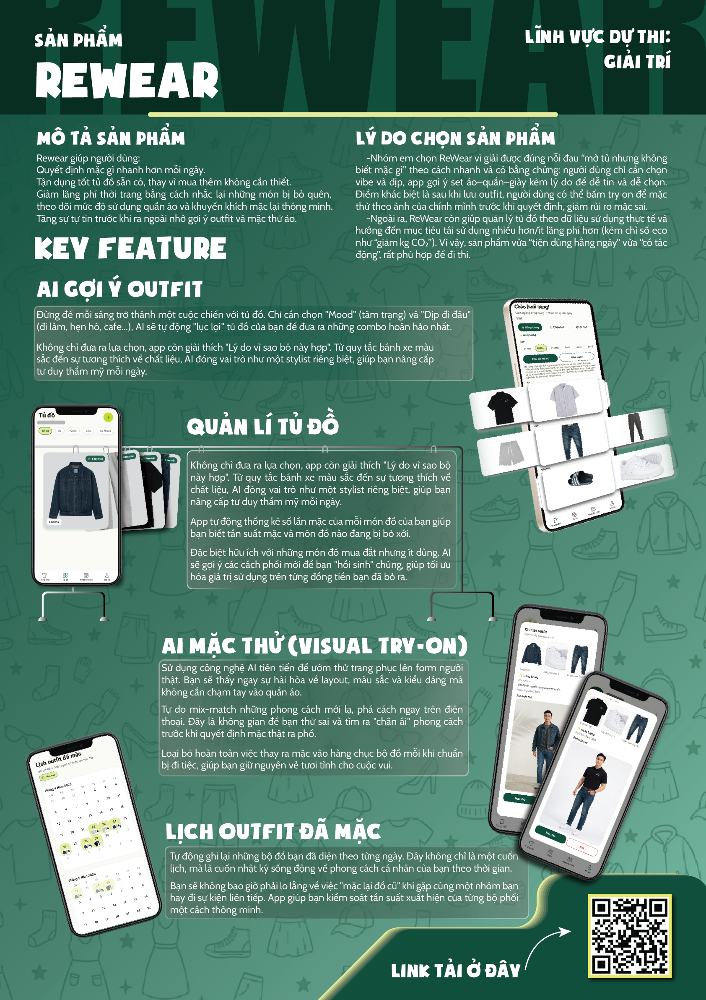

# ReWear - AI Smart Wardrobe for Sustainable Fashion

ReWear không chỉ là app "quản lý tủ đồ". Đây là hệ thống giúp người dùng ra quyết định mặc đồ thông minh hơn bằng dữ liệu thật, AI thật, và hành vi thật:

- Biết nên mặc gì ngay hôm nay.
- Biết món nào đang lãng phí tiền vì ít mặc.
- Biết lịch sử mặc để tránh lặp outfit nhàm chán.
- Biết món nào bị bỏ quên để kéo lại vòng đời sử dụng.

Mục tiêu sản phẩm: biến "thời trang bền vững" từ khẩu hiệu thành hành động hàng ngày.

---

## 1) Product Highlights (điểm ăn tiền)

### 1. AI Outfit Suggestion (Phối đồ với AI theo ngữ cảnh)

Người dùng chọn:
- `Vibe` (đi học, đi làm, đi chơi, ...)
- `Occasion` (ngữ cảnh cụ thể)

Hệ thống:
- Dùng tủ đồ thật của user làm input
- Sinh gợi ý outfit có lý do (`reason`)
- Hiển thị và cho phép chốt nhanh bằng 2 hành vi tách bạch:
  - `Mặc ngay`: ghi nhận hành vi mặc thực tế
  - `Lưu set`: lưu outfit để dùng lại

=> UX tách rõ giữa "dùng thật" và "lưu tham khảo", tránh sai dữ liệu.

### 2. Wear Intelligence: Cost-per-Wear (CPW)

Mỗi garment có:
- `purchasePriceVnd`
- `wearCount`

Từ đó app tính:
- CPW = `purchasePriceVnd / wearCount`
- Filter `Lãng phí nhất` để surfacing các món có hiệu năng sử dụng thấp

=> Đây là phần tạo khác biệt mạnh về business value: giúp user nhìn thấy "chi phí ẩn" trong thói quen mua sắm/mặc đồ.

### 3. Wear Log Calendar (Nhật ký mặc dạng lịch)

Thay vì list thô, ReWear lưu và hiển thị lịch mặc theo tháng:
- Nhật ký mỗi ngày đã mặc outfit nào
- Thumbnail outfit trực quan
- Chạm vào ngày để xem chi tiết set đã mặc

=> Người dùng có trí nhớ thị giác về lịch sử phối đồ, tránh lặp và tăng chất lượng tự phối.

### 4. Local Notification: Nhắc đồ bị bỏ quên

App tự xác định món "bị quên" dựa trên:
- `lastWornAt` nếu đã từng mặc
- `createdAt` nếu chưa từng mặc

Mỗi ngày app nhắc với nội dung động có tên món đồ, không nhắc kiểu generic.
Khi đổi giờ nhắc, hệ thống tự reschedule.

=> Tạo vòng lặp hành vi: "phát hiện bị quên -> mặc lại -> tăng wearCount -> giảm lãng phí".

### 5. AI Virtual Try-On cho outfit đã lưu

Virtual try-on trong ReWear tập trung vào **quyết định trước khi mặc thật**:

- Người dùng có thể mở lại outfit đã lưu và bấm `Mặc thử` ngay trong Profile.
- Ảnh mặc thử giúp trả lời nhanh 3 câu hỏi thực tế:
  - Set này có hợp dáng mình không?
  - Tone màu lên người có ổn không?
  - Có đáng để mặc hôm nay hay cần đổi set khác?
- Vì chạy trực tiếp từ outfit đã save, user không cần phối lại từ đầu -> giảm friction, tăng tỷ lệ "ra quyết định mặc thật".
- Khi chưa ưng, user quay lại Home để đổi vibe/occasion rồi thử tiếp, tạo vòng lặp thử - chỉnh - chốt rất tự nhiên.

=> Giá trị chức năng: giảm "đắn đo trước gương", tăng tốc độ chốt outfit, và giúp người dùng tự tin mặc lại các set cũ thay vì mua mới.

---

## 2) User Journey End-to-End

1. User upload/chụp đồ vào tủ.
2. Chọn vibe + dịp -> nhận gợi ý AI outfit.
3. Bấm `Mặc ngay`:
   - tăng `wearCount`
   - cập nhật `lastWornAt`
   - ghi vào `WearLog`
4. Theo dõi lịch mặc trong tab Nhật ký mặc.
5. Xem filter `Lãng phí nhất` để biết món nào cần mặc lại.
6. Nhận local notification nhắc món đang bị bỏ quên.
7. Với outfit yêu thích, bấm mặc thử AI để preview.

Toàn bộ vòng lặp xoay quanh 1 mục tiêu: tăng hiệu năng sử dụng tủ đồ cá nhân.

---

## 3) Functional Scope (đầy đủ tính năng hiện có)

- Auth: đăng ký, đăng nhập, refresh token, logout
- Hồ sơ người dùng:
  - avatar/person image
  - tên, chiều cao, cân nặng
- Wardrobe:
  - create/update/delete garment
  - phân loại garment (`top`, `bottom`, `shoes`, `outer`, `accessory`)
  - hiển thị số lần mặc + giá mua + CPW
  - filter theo category + filter `Lãng phí nhất`
- Outfit:
  - suggest AI outfit
  - save / delete saved outfit
  - try-on saved outfit
- Wear Log:
  - create log khi mặc
  - đọc lịch sử log để render lịch
- Notification:
  - local notification hằng ngày
  - nội dung nhắc theo món đồ bị quên lâu nhất

---

## 4) Why This Is Not a Demo Toy

ReWear không dừng ở màn hình đẹp:
- Có data model rõ ràng cho hành vi thực (`wearCount`, `lastWornAt`, `WearLog`)
- Có business metric rõ (`CPW`) thay vì chỉ "AI cho vui"
- Có flow UX phân nhánh đúng nghĩa (mặc vs lưu)
- Có integration AI đa nguồn (Gemini + VTON) với error handling thực tế
- Có reminder loop để tác động lại hành vi user theo thời gian

Nói cách khác: đây là product có hypothesis, có loop, có signal để đo được tác động.

---

## 5) Demo

Xem video giới thiệu và hướng dẫn sử dụng ứng dụng ReWear:

---

## 6) Tải về (Download)

Quét mã QR dưới đây để tải và trải nghiệm ứng dụng:

